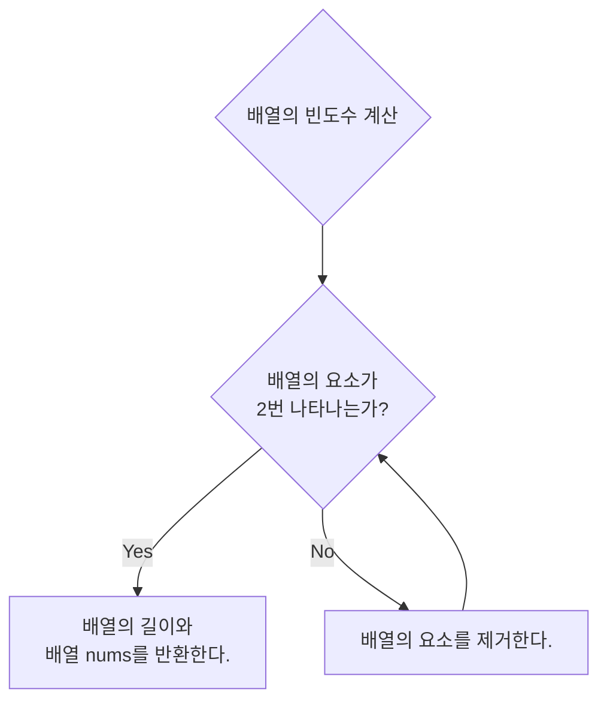
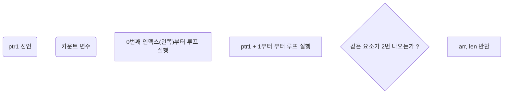

```mermaid
flowchart TD
    case0{"배열의 빈도수 계산"}
    case1{"배열의 요소가<br>2번 나타나는가?"}
    result1["배열의 길이와<br>배열 nums를 반환한다."]
    result2["배열의 요소를 제거한다."]
    case0 --> case1
    case1 -- Yes --> result1
    case1 -- No --> result2
    result2 --> case1
```

## 다른 설계

```mermaid
flowchart TD
    variable1("ptr1 선언")
    variable3("카운트 변수")
    loop1["0번째 인덱스(왼쪽)부터 루프 실행<br>"]
    loop2["ptr1 + 1부터 부터 루프 실행"]
    case1{"같은 요소가 2번 나오는가 ?"}
    result1["요소를 제거한다."]
    result1["arr, len 반환"]
```